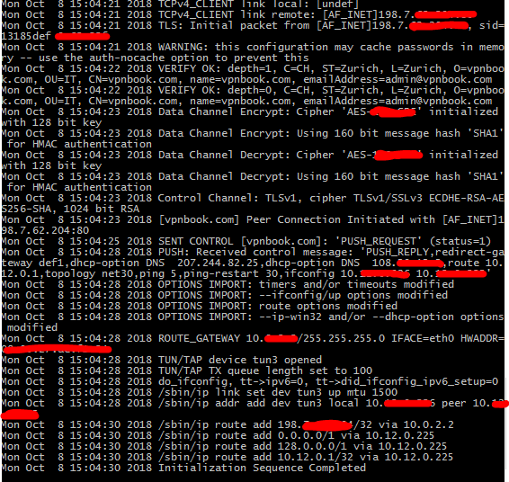

#  ***ManianguaVPN*** - ***Simple python VPN Connection*** ✔️ | 
[]()
[]()
[]()
[](https://awesome.re)
 
# ***Description***: 

Simple script python To make a connection VPN 

## ***Installation Linux*** :
```shell
$ git clone https://github.com/Sanix-Darker/ManianguaVPN

$ cd ManianguaVPN 

$ python2 Maniangua.py
```
## ***Installation Linux*** :
Still coding the bash way 

## ***Screenshot*** :

